# 🚗 Self-Driving Cars Perception Suite 🏎️💨

[](https://github.com/ultralytics/ultralytics)
[](https://pytorch.org/)
[](https://opencv.org/)
[](https://git-lfs.github.com/)
[](LICENSE)

An end-to-end, multi-modal autonomous vehicle visual perception system featuring **real-time object detection**, **classical & deep learning lane detection**, and **drivable area semantic road segmentation** powered by **YOLO11** and **OpenCV**.

---

## 🌟 Key Perception Capabilities

| Module | Technique / Model | Primary Objective | Real-time FPS |
| :--- | :--- | :--- | :---: |
| **1. Traffic Object Detection** | YOLO11 Large (`yolo11l.pt`) | Cars, Pedestrians, Bicycles, Trucks, Buses, Traffic Lights | ~45-60+ FPS |
| **2. Classical Lane Detection** | OpenCV IPM + HSV + Sliding Windows | Fast geometric lane curvature & center offset tracking | ~80-120 FPS |
| **3. Deep Learning Lane Segmentation** | YOLO11 Large Segment (`yolo11l-seg.pt`) | Robust pixel-level lane boundary mask under complex lighting | ~35-50 FPS |
| **4. Drivable Area Segmentation** | YOLO11 Large Segment (`yolo11l-seg.pt`) | Full drivable road surface mask & navigable path prediction | ~35-50 FPS |

---

## 📸 Inference Demonstrations & Results

### 1️⃣ Vehicle & Pedestrian Multi-Class Detection
High-accuracy real-time bounding box detection, classification, and moving average FPS profiling for on-road dynamic agents.

<div align="center">
  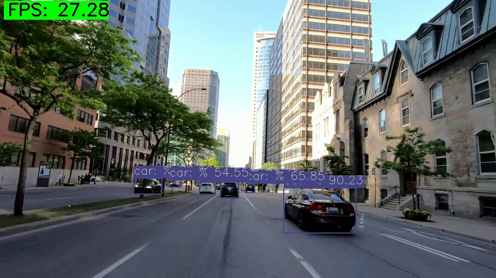
  <p><i>Figure 1: Real-time multi-agent vehicle & pedestrian detection with confidence scoring and live FPS overlay.</i></p>
</div>

---

### 2️⃣ Classical Lane Detection (OpenCV & IPM Pipeline)
Uses **Inverse Perspective Mapping (IPM)** for Bird's-Eye View perspective transformation, HSV dynamic color filtering, and iterative sliding window histogram peak detection.

<div align="center">
  <table>
    <tr>
      <td align="center" width="33%">
        <b>1. ROI Selection & Warping</b><br/>
        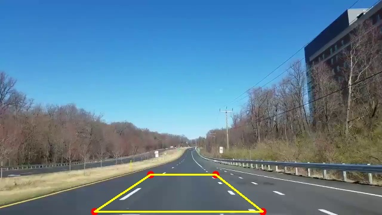
      </td>
      <td align="center" width="33%">
        <b>2. Bird's Eye View (IPM)</b><br/>
        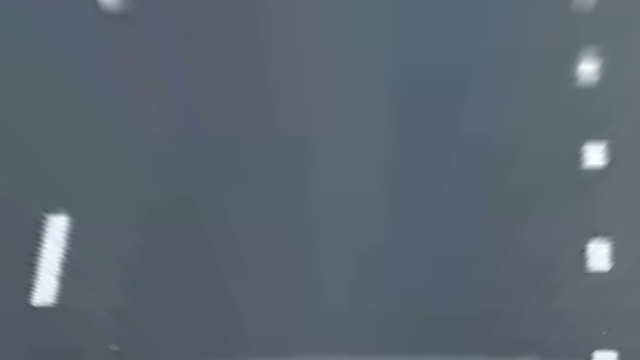
      </td>
      <td align="center" width="33%">
        <b>3. Sliding Window Tracking</b><br/>
        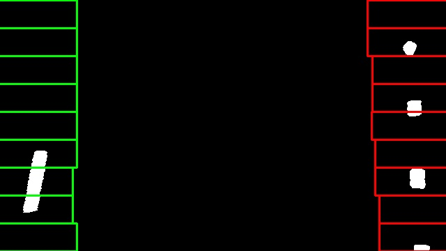
      </td>
    </tr>
  </table>
  <p><i>Figure 2: Perspective Transform pipeline: Trapezoidal ROI coordinates &rarr; IPM Warping &rarr; Polynomial centroid sliding windows.</i></p>
</div>

---

### 3️⃣ Deep Learning Lane Segmentation (YOLO11-Seg)
Trained for **250 epochs** on custom lane marking datasets with spatial augmentations to deliver crisp lane boundaries in adverse weather and shadows.

<div align="center">
  <table>
    <tr>
      <td align="center" width="50%">
        <b>Validation Batch Predictions</b><br/>
        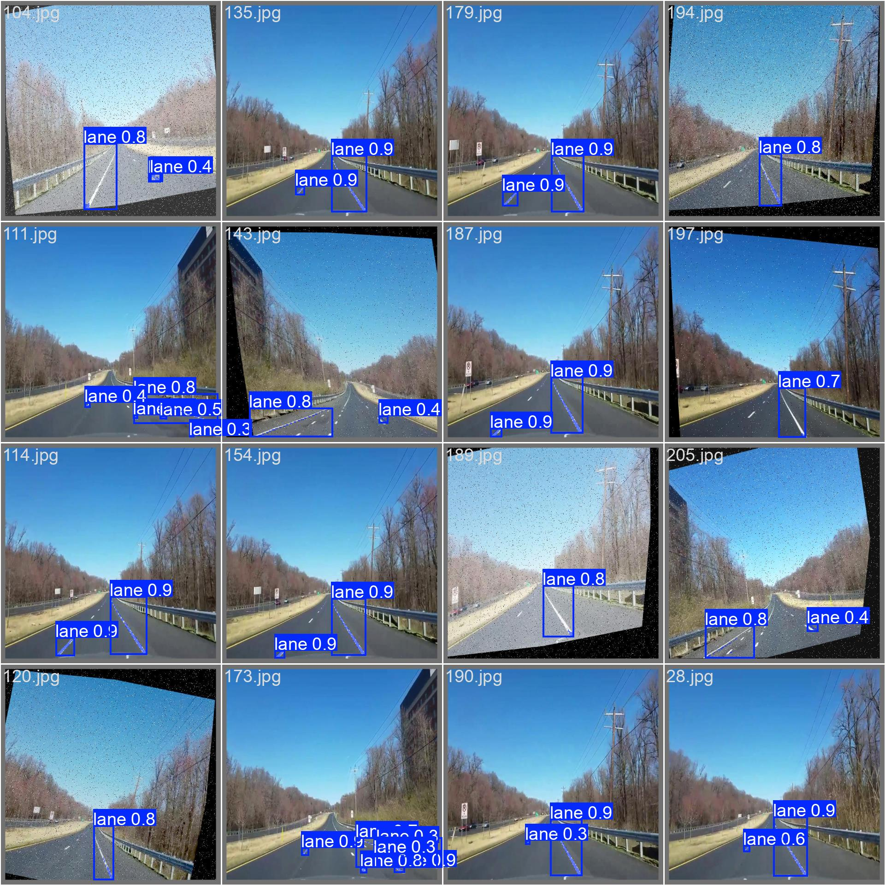
      </td>
      <td align="center" width="50%">
        <b>Video Inference Sample</b><br/>
        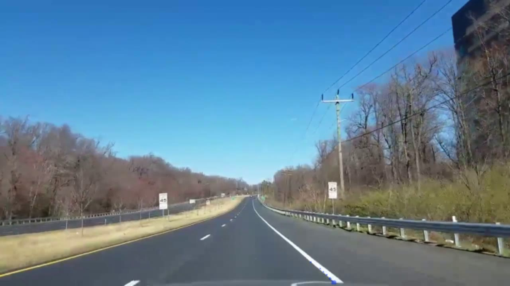
      </td>
    </tr>
  </table>
  <p><i>Figure 3: YOLO11-seg lane segmentation validation batch (left) and live on-road video inference output (right).</i></p>
</div>

---

### 4️⃣ Drivable Area & Road Surface Segmentation (YOLO11-Seg)
Trained for **100 epochs** on comprehensive road surface datasets for drivable vs. non-drivable road surface segmentation.

<div align="center">
  <table>
    <tr>
      <td align="center" width="50%">
        <b>Drivable Road Surface Mask</b><br/>
        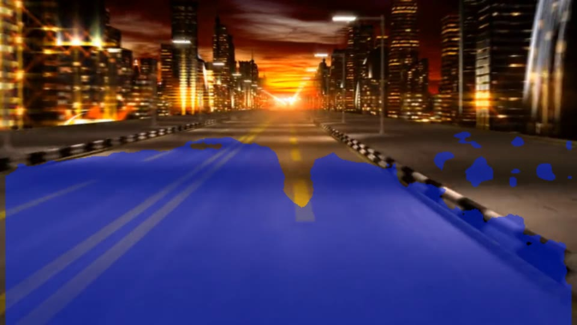
      </td>
      <td align="center" width="50%">
        <b>Urban Scene Test Inference</b><br/>
        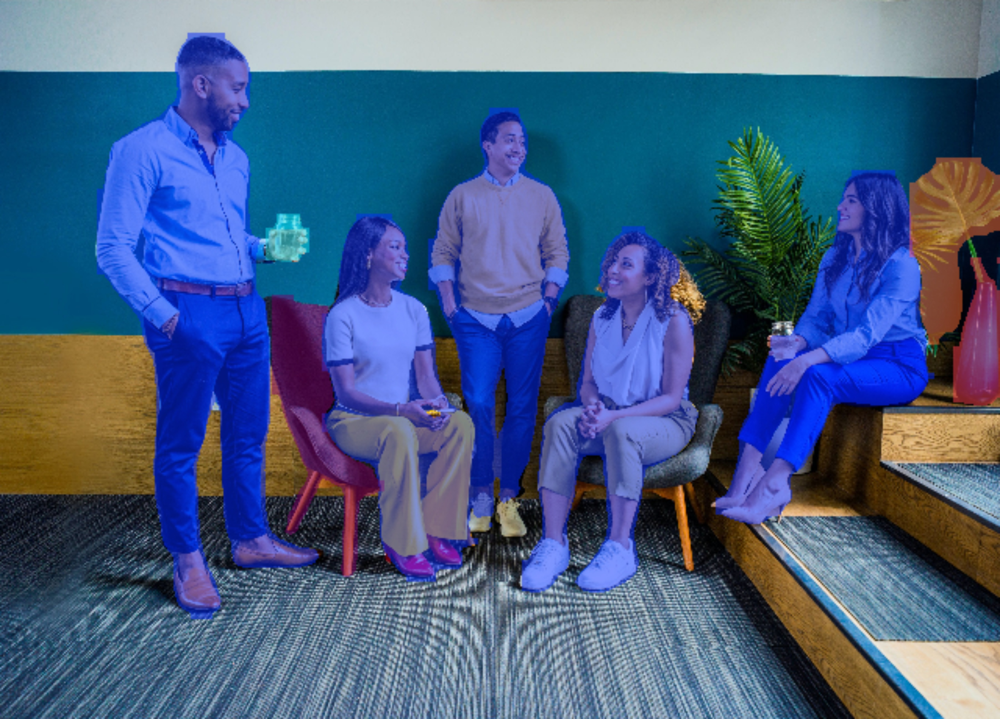
      </td>
    </tr>
  </table>
  <p><i>Figure 4: Real-time drivable area segmentation across highway driving and complex urban environments.</i></p>
</div>

---

## 📊 Model Training & Evaluation Metrics

### 📈 Training Convergence & Performance Curves

<div align="center">
  <table>
    <tr>
      <td align="center" width="50%">
        <b>Lane Segmentation Training (250 Epochs)</b><br/>
        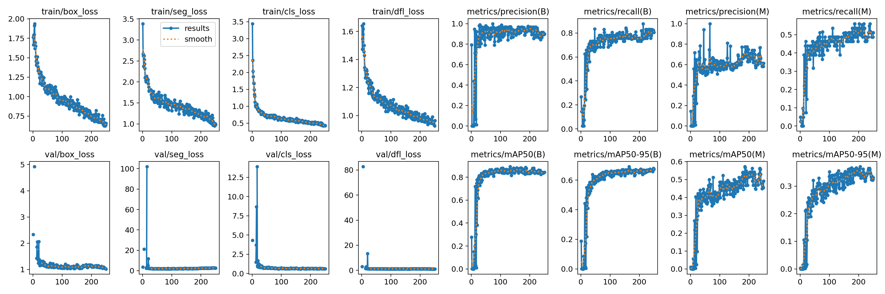
      </td>
      <td align="center" width="50%">
        <b>Road Surface Training (100 Epochs)</b><br/>
        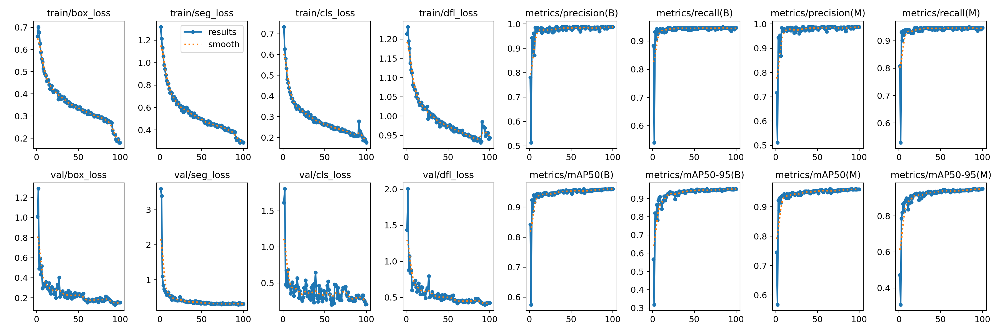
      </td>
    </tr>
    <tr>
      <td align="center" width="50%">
        <b>Lane Confusion Matrix</b><br/>
        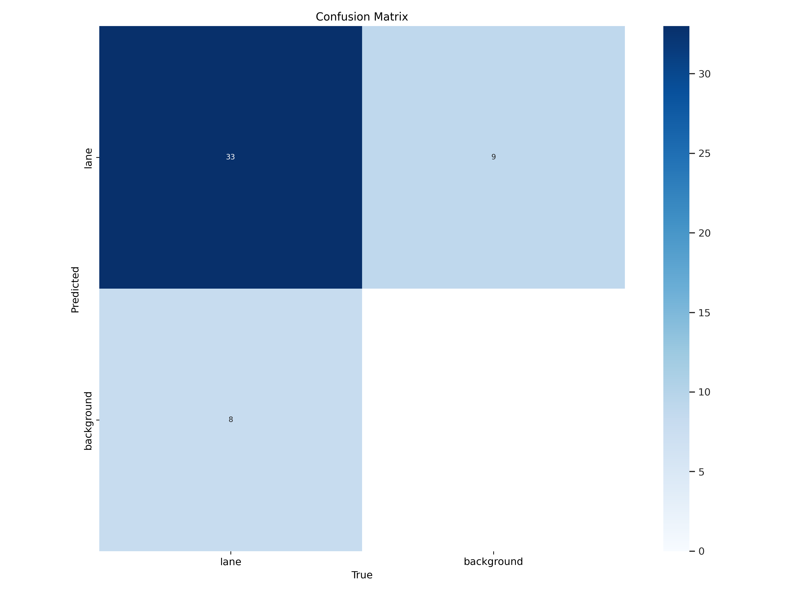
      </td>
      <td align="center" width="50%">
        <b>Road Confusion Matrix</b><br/>
        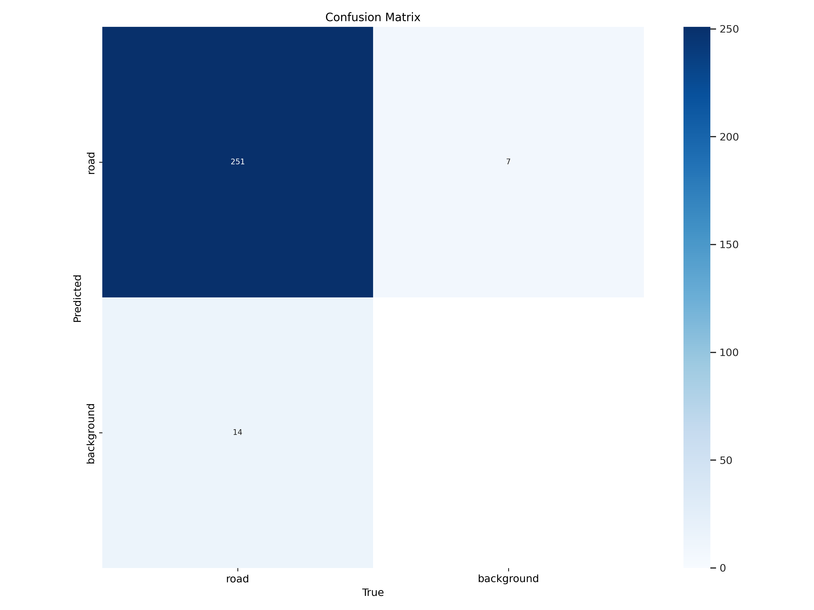
      </td>
    </tr>
  </table>
</div>

---

## 📁 Repository Structure

```text
Self-Driving-Cars-Demo/
├── 📂 Car&Person Detection/
│   ├── 📜 detect.py                   # YOLO11 real-time detection & video recorder script
│   ├── 📜 coco_classes.txt            # COCO dataset class index definitions
│   ├── 📂 models/
│   │   └── 📦 yolo11l.pt              # Pretrained YOLO11 Large weights (Git LFS)
│   ├── 📂 inference/                  # Test input video recordings
│   └── 📂 results/                    # Processed output video with detections & FPS
│
├── 📂 Lane Detection with OpenCV/
│   ├── 📜 detect_lane.py              # Bird's-eye view IPM & sliding window lane tracker
│   ├── 📜 roi_selector.py             # Interactive Region-of-Interest coordinate calibration
│   ├── 🖼️ coordinates.png             # Visual guide for IPM perspective points
│   └── 📂 test_videos/                # Benchmark dashcam road videos
│
├── 📂 Lane Detection with YOLO/
│   ├── 📓 Lane segmentation.ipynb     # Complete training, validation, and inference pipeline
│   ├── 📂 data/
│   │   ├── 📜 config.yaml             # Dataset YAML paths and class definitions
│   │   └── 📦 dataset.zip             # Annotated lane segmentation dataset (Git LFS)
│   └── 📂 runs/segment/               # Checkpoints, validation batches, and metrics
│
├── 📂 Roading Segmentation (Driveable Area)/
│   ├── 📓 Road Segmentation.ipynb     # Road segmentation model training & inference notebook
│   ├── 📂 data/
│   │   ├── 📜 data.yaml               # Road surface dataset configuration
│   │   └── 📦 road_surface_dataset.zip# High-resolution road surface dataset (Git LFS)
│   └── 📂 runs/segment/               # Training logs, weights/best.pt, and predict outputs
│
├── 📂 assets/                         # Documentation images, graphs, and preview frames
├── 📜 .gitattributes                  # Git LFS rules for large model weights and videos
├── 📜 .gitignore                      # Python/Jupyter clean ignore configuration
├── 📜 requirements.txt                # Python package dependencies
└── 📜 README.md                       # Main documentation
```

---

## 🚀 Getting Started & Installation

### 1. Clone the Repository (with Git LFS)
Make sure [Git LFS](https://git-lfs.com/) is installed on your system before cloning:

```bash
# Install Git LFS (if not already installed)
git lfs install

# Clone the repository
git clone https://github.com/faatihucar/Self-Driving-Cars-Demo.git
cd Self-Driving-Cars-Demo

# Pull large binaries & model weights
git lfs pull
```

### 2. Set Up Virtual Environment & Dependencies
```bash
# Create a virtual environment
python -m venv venv

# Activate the virtual environment
# Windows:
venv\Scripts\activate
# Linux / macOS:
source venv/bin/activate

# Install required packages
pip install -r requirements.txt
```

---

## 💻 Usage & Running the Modules

### 🚗 Run Car & Pedestrian Detection
```bash
cd "Car&Person Detection"
python detect.py
```
> Press `q` to terminate live preview. The annotated video with live FPS counters will be automatically exported to `results/test_vid_res.avi`.

### 🛣️ Run OpenCV Classical Lane Detection
```bash
cd "Lane Detection with OpenCV"
python detect_lane.py
```
> Adjust the interactive HSV trackbars (`L-H`, `L-S`, `L-V`, `U-H`, `U-S`, `U-V`) to fine-tune color thresholding under varying road surfaces. Press `ESC` to exit.

### 🧠 Run YOLO Lane or Road Segmentation
You can run inference directly using the trained PyTorch weights:

```bash
# Lane Segmentation Inference
yolo segment predict model="Lane Detection with YOLO/runs/segment/yolov11_lane_segmentation/weights/best.pt" source="Lane Detection with OpenCV/test_videos/road.mp4" show_labels=False show_boxes=False

# Drivable Area Segmentation Inference
yolo segment predict model="Roading Segmentation (Driveable Area)/runs/segment/yolov11_road_segmentation2/weights/best.pt" source="Roading Segmentation (Driveable Area)/inference/road.mp4" show_labels=False show_boxes=False
```

Or open and execute the Jupyter Notebooks:
- `Lane Detection with YOLO/Lane segmentation.ipynb`
- `Roading Segmentation (Driveable Area)/Road Segmentation.ipynb`

---

## 🛠️ Tech Stack & Libraries

- **Deep Learning Frameworks**: [Ultralytics YOLO11](https://github.com/ultralytics/ultralytics), [PyTorch](https://pytorch.org/), Torchvision
- **Computer Vision**: [OpenCV (cv2)](https://opencv.org/), NumPy, Imutils
- **Data Visualization**: Matplotlib, Seaborn, Pandas
- **Storage & Version Control**: Git Large File Storage (LFS)

---

## 👨‍💻 Author & Contact

Developed by **[Fatih Uçar](https://github.com/faatihucar)**

Feel free to open issues or contribute pull requests to enhance the self-driving perception algorithms!
